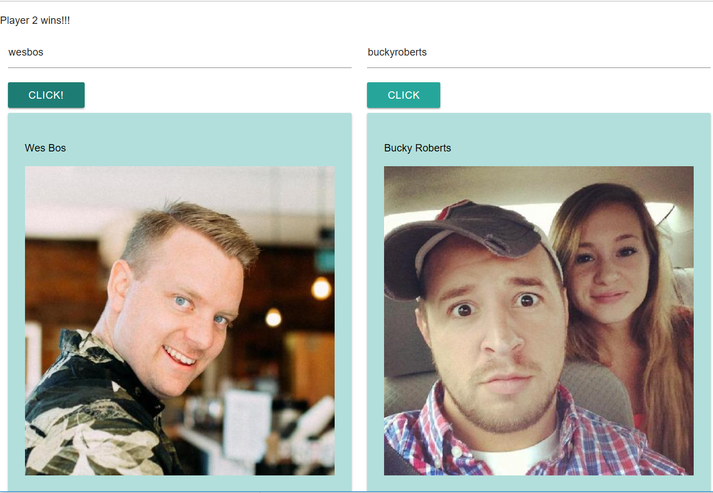

This project was bootstrapped with [Create React App](https://github.com/facebookincubator/create-react-app).

# GITWARS

# React App that compares two profiles

# FEATURES
* Search function
* Shows profile: picture, number of followers and number of repositories
* Displays output

## Folder Structure

```
my-app/
  README.md
  node_modules/
  package.json
  public/
    index.html
  src/
    App.css
    App.js
    App.test.js
    index.css
    index.js
    Judging.js
    PlayerProfile.js
```

### npm start

Runs the app in the development mode.<br>
Open [http://localhost:3000](http://localhost:3000) to view it in the browser.

